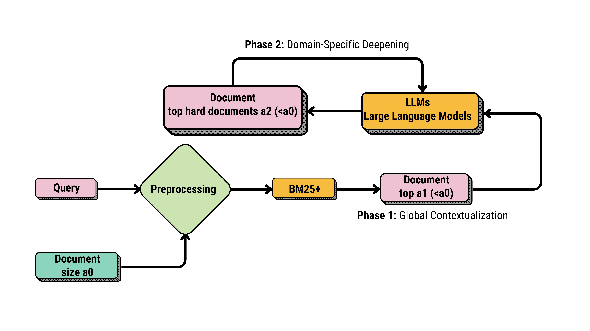

<div align="center">
   
</div>

# Adaptive Two-Phase Finetuning LLMs for Japanese Legal Text Retrieval

## Table of Contents

1. [Introduction](#introduction)
2. [Dataset Information](#dataset-information)
3. [Project Structure](#project-structure)
4. [Requirements](#requirements)
5. [Usage Guide](#usage-guide)
6. [Citation](#citation)
7. [License](#license)
8. [Contributing](#contributing)

---

## Introduction

This repository provides a complete workflow for training and evaluating a legal document retrieval system specialized for Japanese legal texts. The system combines traditional BM25 with fine-tuned language models through an adaptive two-phase training approach.

### Key Features
- **Specialized for Japanese Legal Domain**: Trained on Japanese legal documents from e-Gov website
- **Two-Phase Training**: Iterative training rounds with hard negative mining for improved performance
- **Hybrid Retrieval**: Ensemble of BM25 and neural models for robust results
- **Production-Ready**: Includes model quantization for deployment on limited hardware
- **Complete Pipeline**: From raw data processing to model evaluation

### Technical Foundation
This project builds upon [Tevatron](https://github.com/texttron/tevatron), a library for dense retrieval tasks. We customized the implementation with:
- Modified training pipeline for RepLLaMA architecture
- Quantization support for resource-constrained environments
- Hard negative mining strategies
- BM25 fallback mechanism for handling quantization-induced NaN values

---

## Dataset Information

### Overview
The dataset consists of Japanese legal documents with query-document pairs for retrieval tasks.

### Statistics
- **Corpus Size**: 743 documents
- **Training Queries**: 3259 queries
- **Validation Queries**: 70 queries  
- **Test Queries**: 130 queries  
- **Data Format**: JSONL

### Data Structure
```bash
vjdatabase/
├── legal_corpus.json               # Legal documents with doc_id and text
├── train_retrieval_data.json       # Training query-document pairs
├── validation_retrieval_data.json  # Validation queries with relevant documents
└── test_retrieval_data.json        # Test queries with relevant documents
```

### Data Source
The root data originates from e-Gov website https://laws.e-gov.go.jp/, processed and adapted for Japanese legal document retrieval tasks.

---

## Project Structure
```bash
ATFLLM/
├── create_hardnegative_data/ # Create dataset for round 2
├── create_japanese_data/ # Format data after raw data processing
├── create_root_data/ # Create and process raw data
├── ensemble/ # Ensemble methods
├── Images/ # Images for GitHub repository
├── inference/ # Model inference
├── scripts/ # Main code for training RepLLaMA
├── tevatron/ # Dense retrieval library
├── requirements.txt # Dependencies
└── README.md
```

### Key Directories
- **create_japanese_data**: Scripts for processing raw data into training format
- **tevatron**: Core retrieval model implementation (adapted from Texttron)
- **scripts/repllama**: Training pipeline for RepLLaMA model
- **ensemble**: BM25 and neural model ensemble strategies
---

## Requirements

### Environments
Ensure the following are installed:
- Python 3.9.19
   ```bash
   conda create -n new_atf python==3.9.19
   ```
- Required libraries from `requirements.txt`
   ```bash
   pip install -r requirements.txt
   ```
- You can run this script for install all: 
[install_lib.sh](./install_lib.sh)
   ```bash
   cd tevatron
   export PYTHONPATH=$PYTHONPATH:$(pwd)
   cd ..
   ```
---

### Hardware Requirements
- **GPU**: NVIDIA GPU with at least 16GB VRAM (24GB recommended)
- **RAM**: 32GB+ system memory
- **Disk Space**: 100GB+ free space for models and datasets
- **Training Time**: ~70 hours per round on single GPU (A100/V100)

---

## Usage Guide

### Dataset Creation

#### Step 1: Create Japanese Dataset
Use the `create_japanese_data` directory to prepare the dataset.

1. **Download root data from Hugging Face**  
   ```bash
   python load_data_from_hub.py
   ```

2. **Generate the corpus, training and test datasets**  
   You can see more details in the [scripts.md](./create_japanese_data/scripts.md) file.

---

### Training and Evaluation Workflow

#### Step 2: Training - Round 1
Run the following script to start the first training round:
   ```bash
   ./run_train_round1.sh
   ```

- It took almost 70 hours to train this round. If you don't want to wait, you can use the pre-trained checkpoint from Hugging Face for the next steps: [gptvj/atfllm-r1](https://huggingface.co/gptvj/atfllm-r1)

#### Step 3: Create Hard Negatives for Round 2

1. **Generate ranked files using the model trained in round 1:**  
   ```bash
   create_hardnegative_data/create_top_negative_round2.sh pretrained_model/model_repllama_50_hard_round1_2_batch/checkpoint-2800
   ```
   Or use checkpoint from Hugging Face:
   ```bash
   create_hardnegative_data/create_top_negative_round2.sh gptvj/atfllm-r1
   ```

2. **Resolve NaN errors and replace with BM25 negatives**  
To address potential NaN issues caused by the quantization process, we will handle hard negatives in two ways: for sentences resulting in NaN, we will regenerate hard negatives using BM25; for the remaining sentences, we will leverage incorrect data from round 1 to construct hard negatives, ensuring more robust and effective training.
   ```bash
   python create_hardnegative_data/create_hard_negative_resolve_nan_error.py
   ```

#### Step 4: Training - Round 2
Run the following script to start the second training round:
   ```bash
   ./run_train_round2.sh pretrained_model/model_repllama_50_hard_round1_2_batch/checkpoint-2800
   ```
   Or use checkpoint from Hugging Face:
   ```bash
   ./run_train_round2.sh gptvj/atfllm-r1
   ```

- It took almost 70 hours to train this round. If you don't want to wait, you can use the pre-trained checkpoint from Hugging Face for the next steps: [gptvj/atfllm-r2](https://huggingface.co/gptvj/atfllm-r2)

#### Step 5: Evaluate

1. **Inference on checkpoints from round 1 and round 2**  
   You can see more details in the [scripts.md](./inference/scripts.md) file.

2. **Evaluate Round 1 Model**  
   ```bash
   python evaluate_metrics.py --test_ds_path japanese_datasets/test_retrieval_ja --rank_txt_path temp/jp_round1_2800/rank_japanese.txt
   ```
3. **Evaluate Round 2 Model**  
   ```bash
   python evaluate_metrics.py --test_ds_path japanese_datasets/test_retrieval_ja --rank_txt_path temp/jp_full_cp_ckpt_round2_400/rank_japanese.txt
   ```

---
### Ensemble Evaluation

#### Step 6: Ensemble Rankings

1. **Create BM25 rank file**  
   ```bash
   python ensemble/create_rank_bm25.py
   ```

2. **Ensemble bm25, round1, round2**  
   ```bash
   python ensemble/ensemble_bm25_llm1_llm2.py
   ```

3. **Evaluate the BM25**  
   ```bash
   python evaluate_metrics.py --test_ds_path japanese_datasets/test_retrieval_ja --rank_txt_path temp/sorted_bm25_rank.txt
   ```

4. **Evaluate the merged ensemble (BM25 + round1 + round2)**  
   ```bash
   python evaluate_metrics.py --test_ds_path japanese_datasets/test_retrieval_ja --rank_txt_path temp/rank_ensemble/merge_rank.txt
   ```

---

#### Results
The ensemble model achieves the following metrics on the test set:

```bash
Precision and Recall at different k values:
+-----+-------------+----------+
|  k  | Precision@k | Recall@k |
+-----+-------------+----------+
|  3  |    0.4128   |  0.6437  |
|  5  |    0.3108   |  0.7632  |
|  10 |    0.1769   |  0.8369  |
|  20 |    0.0958   |  0.8864  |
|  50 |    0.0398   |  0.9213  |
| 100 |    0.0210   |  0.9592  |
| 200 |    0.0109   |  0.9841  |
+-----+-------------+----------+

MAP and MRR:
+--------+--------+
| Metric | Value  |
+--------+--------+
| MAP@10 | 0.6667 |
| MRR@10 | 0.8420 |
+--------+--------+

My Recall at different k values:
+-----+-------------+
|  k  | My_recall@k |
+-----+-------------+
|  3  |    0.6846   |
|  5  |    0.7700   |
|  10 |    0.8373   |
|  20 |    0.8864   |
|  50 |    0.9213   |
| 100 |    0.9592   |
| 200 |    0.9841   |
+-----+-------------+

NDCG@10: 0.7472
```

---

## Citation
If you use this work in your research, please cite it as:

```bash
@misc{trung2024adaptivetwophasefinetuningllms,
      title={Adaptive Two-Phase Finetuning LLMs for Japanese Legal Text Retrieval}, 
      author={Quang Hoang Trung and Nguyen Van Hoang Phuc and Le Trung Hoang and Quang Huu Hieu and Vo Nguyen Le Duy},
      year={2024},
      eprint={2412.13205},
      archivePrefix={arXiv},
      primaryClass={cs.IR},
      url={https://arxiv.org/abs/2412.13205}, 
}
```


## License

This project is licensed under the Apache License 2.0 - see the [LICENSE](LICENSE) file for details.

### Third-Party Licenses
- **Tevatron**: Apache License 2.0 (see [Tevatron repository](https://github.com/texttron/tevatron))
- **Pre-trained Models**: Check individual model cards on Hugging Face

## Contributing

We welcome contributions to improve this project!

### How to Contribute
1. Fork the repository
2. Create a feature branch (`git checkout -b feature/your-feature`)
3. Commit your changes (`git commit -m 'Add some feature'`)
4. Push to the branch (`git push origin feature/your-feature`)
5. Open a Pull Request

### Contribution Guidelines
- Follow PEP 8 style guidelines for Python code
- Add tests for new features
- Update documentation as needed
- Ensure all tests pass before submitting PR

### Reporting Issues
Please use the [issue tracker](https://github.com/gptvj/ATFLLM/issues) to report bugs or request features.